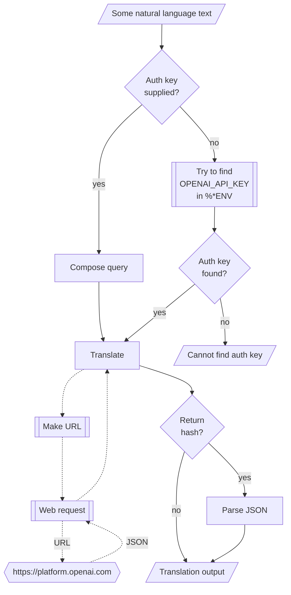

# WWW::OpenAI Raku package

## In brief

This Raku package provides access to the language translation service [OpenAI](https://platform.openai.com), [OAI1].
For more details of the OpenAI's API usage see [the documentation](https://platform.openai.com/docs/api-reference/making-requests), [OAI2].

**Remark:** To use the OpenAI API one has to register and obtain authorization key.

**Remark:** This Raku package is much "less ambitious" than the official Python package, [OAIp1], developed by OpenAI's team.
Gradually, over time, I expect to add features to the Raku package that correspond to features of [OAIp1].

-----

## Installation

Package installations from both sources use [zef installer](https://github.com/ugexe/zef)
(which should be bundled with the "standard" Rakudo installation file.)

To install the package from [Zef ecosystem](https://raku.land/) use the shell command:

```
zef install WWW::OpenAI
```

To install the package from the GitHub repository use the shell command:

```
zef install https://github.com/antononcube/Raku-WWW-OpenAI.git
```

----

## Usage examples

**Remark:** When the authorization key, `auth-key`, is specified to be `Whatever`
then `openai-playground` attempts to use the env variable `OPENAI_API_KEY`.

### Basic usage

Here is a simple call:

```perl6
use WWW::OpenAI;
say openai-playground('Колко групи могат да се намерят в този облак от точки.');
```

-------

## Command Line Interface

The package provides a Command Line Interface (CLI) script:

```shell
openai-playground --help
```


**Remark:** When the authorization key argument "auth-key" is specified set to "Whatever"
then `openai-playground` attempts to use the env variable `OPENAI_API_KEY`.

--------

## Mermaid diagram

The following flowchart corresponds to the steps in the package function `openai-playground`:



--------

## Potential problems

- Tested in macOS only.
- I have to figure out how to replace the `curl` queries with "direct" URLs...

--------

## References

[OAI1] OpenAI Platform, [OpenAI platform](https://platform.openai.com/).

[OAI1] OpenAI Platform, [OpenAI documentation](https://platform.openai.com/docs).

[OAIp1] OpenAI,
[OpenAI Python Library](https://github.com/openai/openai-python),
(2020),
[GitHub/openai](https://github.com/openai/).