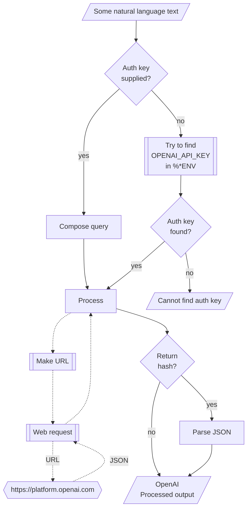

# WWW::OpenAI Raku package

## In brief

This Raku package provides access to the machine learning service [OpenAI](https://platform.openai.com), [OAI1].
For more details of the OpenAI's API usage see [the documentation](https://platform.openai.com/docs/api-reference/making-requests), [OAI2].

**Remark:** To use the OpenAI API one has to register and obtain authorization key.

**Remark:** This Raku package is much "less ambitious" than the official Python package, [OAIp1], developed by OpenAI's team.
Gradually, over time, I expect to add features to the Raku package that correspond to features of [OAIp1].

The design and implementation of "WWW::OpenAI" are very similar to those of 
["Lingua::Translation::DeepL"](https://raku.land/zef:antononcube/Lingua::Translation::DeepL), [AAp1]. 

-----

## Installation

Package installations from both sources use [zef installer](https://github.com/ugexe/zef)
(which should be bundled with the "standard" Rakudo installation file.)

To install the package from [Zef ecosystem](https://raku.land/) use the shell command:

```
zef install WWW::OpenAI
```

To install the package from the GitHub repository use the shell command:

```
zef install https://github.com/antononcube/Raku-WWW-OpenAI.git
```

----

## Usage examples

**Remark:** When the authorization key, `auth-key`, is specified to be `Whatever`
then the functions `openai-*` attempt to use the env variable `OPENAI_API_KEY`.

### Universal "front-end"

The package has an universal "front-end" function `openai-playground` for the 
[different functionalities provided by OpenAI](https://platform.openai.com/docs/api-reference/introduction).

Here is a simple call for a "chat completion":

```perl6
use WWW::OpenAI;
openai-playground('Where is Roger Rabbit?', max-tokens => 64);
```

Another one using Bulgarian:

```perl6
openai-playground('Колко групи могат да се намерят в този облак от точки.', max-tokens => 64);
```

**Remark:** The function `openai-completion` can be used instead in the examples above. 
See the section 
["Create chat completion"](https://platform.openai.com/docs/api-reference/chat/create) of [OAI2]
for more details.

### Models

The current OpenAI models can be found with the function `openai-models`:

```perl6
openai-models
```

### Code generation

There are two types of completions : text and chat. Let us illustrate the differences
of their usage by Raku code generation. Here is a text completion:

```perl6
openai-completion(
        'generate Raku code for making a loop over a list',
        type => 'text',
        max-tokens => 120,
        format => 'values');
```

Here is a chat completion:

```perl6
openai-completion(
        'generate Raku code for making a loop over a list',
        type => 'chat',
        max-tokens => 120,
        format => 'values');
```

**Remark:** The argument "type" and the argument "model" have to "agree." (I.e. be found agreeable by OpenAI.)
For example: 
- `model => 'text-davinci-003'` implies `type => 'text'`
- `model => 'gpt-3.5-turbo'` implies `type => 'chat'`


### Image generation

**Remark:** See the files ["Image-generation*"](./docs/Image-generation.md) for more details.

Images can be generated with the function `openai-create-image` -- see the section
["Images"](https://platform.openai.com/docs/api-reference/images) of [OAI2].

Here is an example:

```perl6, eval=FALSE
my $imgB64 = openai-create-image(
        "racoon with a sliced onion in the style of Raphael",
        response-format => 'b64_json',
        n => 1,
        size => 'small',
        format => 'values',
        method => 'tiny');
```

Here are the options descriptions:

- `response-format` takes the values "url" and "b64_json"
- `n` takes a positive integer, for the number of images to be generated
- `size` takes the values '1024x1024', '512x512', '256x256', 'large', 'medium', 'small'. 

Here we generate an image, get its URL, and place (embed) a link to it via the output of the code cell:

```perl6, results='asis', eval=FALSE
my @imgRes = |openai-create-image(
        "racoon and onion in the style of Roy Lichtenstein",
        response-format => 'url',
        n => 1,
        size => 'small',
        method => 'tiny');

'';
```

### Moderation

Here is an example of using 
[OpenAI's moderation](https://platform.openai.com/docs/api-reference/moderations):

```perl6
my @modRes = |openai-moderation(
"I want to kill them!",
format => "values",
method => 'tiny');

for @modRes -> $m { .say for $m.pairs.sort(*.value).reverse; }
```

### Audio transcription and translation

Here is an example of using
[OpenAI's audio transcription](https://platform.openai.com/docs/api-reference/audio):

```perl6
my $fileName = $*CWD ~ '/resources/HelloRaccoonsEN.mp3';
say openai-audio(
        $fileName,
        format => 'json',
        method => 'tiny');
```

To do translations use the named argument `type`:

```perl6
my $fileName = $*CWD ~ '/resources/HowAreYouRU.mp3';
say openai-audio(
        $fileName,
        type => 'translations',
        format => 'json',
        method => 'tiny');
```

### Embeddings

[Embeddings](https://platform.openai.com/docs/api-reference/embeddings)
can be obtained with the function `openai-embeddings`. Here is an example of finding the embedding vectors
for each of the elements of an array of strings:

```perl6
my @queries = [
    'make a classifier with the method RandomForeset over the data dfTitanic',
    'show precision and accuracy',
    'plot True Positive Rate vs Positive Predictive Value',
    'what is a good meat and potatoes recipe'
];

my $embs = openai-embeddings(@queries, format => 'values', method => 'tiny');
$embs.elems;
```

Here we show:
- That the result is an array of three vectors each with length 1536
- The distributions of the values of each vector

```perl6
use Data::Reshapers;
use Data::Summarizers;

say "\$embs.elems : { $embs.elems }";
say "\$embs>>.elems : { $embs>>.elems }";
records-summary($embs.kv.Hash.&transpose);
```

Here we find the corresponding dot products and (cross-)tabulate them:

```perl6
use Data::Reshapers;
use Data::Summarizers;
my @ct = (^$embs.elems X ^$embs.elems).map({ %( i => $_[0], j => $_[1], dot => sum($embs[$_[0]] >>*<< $embs[$_[1]])) }).Array;

say to-pretty-table(cross-tabulate(@ct, 'i', 'j', 'dot'), field-names => (^$embs.elems)>>.Str);
````

**Remark:** Note that the fourth element (the cooking recipe request) is an outlier.
(Judging by the table with dot products.)

-------

## Command Line Interface

The package provides a Command Line Interface (CLI) script:

```shell
openai-playground --help
```

**Remark:** When the authorization key argument "auth-key" is specified set to "Whatever"
then `openai-playground` attempts to use the env variable `OPENAI_API_KEY`.

--------

## Mermaid diagram

The following flowchart corresponds to the steps in the package function `openai-playground`:



--------

## Potential problems

**Remark:** Currently this package is tested on macOS only.

### SSL certificate problems

- On macOS I get the errors:
    
  > Cannot locate symbol 'SSL_get1_peer_certificate' in native library

- See longer discussions about this problem 
  [here](https://stackoverflow.com/questions/72792280/macos-how-to-avoid-ssl-hell-on-intel-mac-with-raku)
  and
  [here](https://github.com/jnthn/p6-io-socket-async-ssl/issues/66)
  
- Interestingly: 
  - I did not get these messages while implementing the changes of ver<1.1> of this package
  - I do not get these messages when using Raku in Markdown or Mathematica notebooks, [AA1],
    via the package ["Text::CodeProcessing"](https://raku.land/zef:antononcube/Text::CodeProcessing)
  
- Because of those SSL problems I implemented the method option that takes the values 'cro' and 'curl'.
  
- The method "curl":
  - Requires [`curl`](https://curl.se) to be installed
  - Invokes the procedure [`shell`](https://docs.raku.org/routine/shell)
  - Again, this is tested on macOS only.  

- After "discovering" "HTTP::Tiny" and given the problems with "Cro::HTTP::Client", I removed the 'cro' method.
  (I.e. the methods are 'tiny' and 'curl' in ver<0.2.0+>.)
  
--------

## TODO

- [ ] TODO Comprehensive unit tests
  - Note that this requires OpenAI auth token and costs money. (Ideally, not much.)
  - [X] DONE Basic usage
  - [X] DONE Completions - chat
  - [X] DONE Completions - text
  - [X] DONE Moderation
  - [X] DONE Audio transcription
  - [X] DONE Audio translation
  - [X] DONE Image generation
  - [X] DONE Embeddings

- [X] DONE HTTP(S) retrieval methods

  - [X] DONE `curl`
  - [X] DONE "Cro"
     - Not used in ver<0.2.0+>.
  - [X] DONE "HTTP::Tiny"

- [X] DONE Models implementation

- [X] DONE Embeddings implementation

- [X] DONE Refactor the code, so each functionality (audio, completion, moderation, etc)
  has a separate file.

- [X] DONE Refactor HTTP(S) retrieval functions to be simpler and more "uniform."

- [X] DONE De-Cro the request code.

  - Given the problems of using "Cro::HTTP::Client" and the implementations with `curl` and 
    ["HTTP::Tiny"](https://gitlab.com/jjatria/http-tiny/-/blob/master/examples/cookbook.md),
    it seems it is better to make the implementation of "WWW::OpenAI" more lightweight.

--------

## References

### Articles

[AA1] Anton Antonov,
["Connecting Mathematica and Raku"](https://rakuforprediction.wordpress.com/2021/12/30/connecting-mathematica-and-raku/),
(2021),
[RakuForPrediction at WordPress](https://rakuforprediction.wordpress.com).

### Packages

[AAp1] Anton Antonov,
[Lingua::Translation::DeepL Raku package](https://github.com/antononcube/Raku-Lingua-Translation-DeepL),
(2022),
[GitHub/antononcube](https://github.com/antononcube).

[AAp2] Anton Antonov,
[Text::CodeProcessing](https://github.com/antononcube/Raku-Text-CodeProcessing),
(2021),
[GitHub/antononcube](https://github.com/antononcube).

[OAI1] OpenAI Platform, [OpenAI platform](https://platform.openai.com/).

[OAI2] OpenAI Platform, [OpenAI documentation](https://platform.openai.com/docs).

[OAIp1] OpenAI,
[OpenAI Python Library](https://github.com/openai/openai-python),
(2020),
[GitHub/openai](https://github.com/openai/).