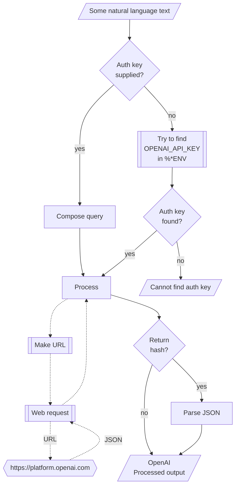

# WWW::OpenAI Raku package

## In brief

This Raku package provides access to the machine learning service [OpenAI](https://platform.openai.com), [OAI1].
For more details of the OpenAI's API usage see [the documentation](https://platform.openai.com/docs/api-reference/making-requests), [OAI2].

**Remark:** To use the OpenAI API one has to register and obtain authorization key.

**Remark:** This Raku package is much "less ambitious" than the official Python package, [OAIp1], developed by OpenAI's team.
Gradually, over time, I expect to add features to the Raku package that correspond to features of [OAIp1].

The design and implementation of "WWW::OpenAI" are very similar to those of 
["Lingua::Translation::DeepL"](https://raku.land/zef:antononcube/Lingua::Translation::DeepL), [AAp1]. 

-----

## Installation

Package installations from both sources use [zef installer](https://github.com/ugexe/zef)
(which should be bundled with the "standard" Rakudo installation file.)

To install the package from [Zef ecosystem](https://raku.land/) use the shell command:

```
zef install WWW::OpenAI
```

To install the package from the GitHub repository use the shell command:

```
zef install https://github.com/antononcube/Raku-WWW-OpenAI.git
```

----

## Usage examples

**Remark:** When the authorization key, `auth-key`, is specified to be `Whatever`
then the functions `openai-*` attempt to use the env variable `OPENAI_API_KEY`.

### Universal "front-end"

The package has an universal "front-end" function `openai-playground` for the 
[different functionalities provided by OpenAI](https://platform.openai.com/docs/api-reference/introduction).

Here is a simple call for a "chat completion":

```perl6
use WWW::OpenAI;
openai-playground('Where is Roger Rabbit?', max-tokens => 64);
```
```
# [{finish_reason => stop, index => 0, logprobs => (Any), text => 
# 
# Roger Rabbit is a fictional character created by Disney and Amblin Entertainment. He first appeared in the 1988 film Who Framed Roger Rabbit. He is typically depicted as a cartoon rabbit who lives in the real world, and is known for his catchphrase "P-p-p-please!"}]
```

Another one using Bulgarian:

```perl6
openai-playground('Колко групи могат да се намерят в този облак от точки.', max-tokens => 64);
```
```
# [{finish_reason => length, index => 0, logprobs => (Any), text => 
# 
# Във всеки облак от точки може да се намерят неограничен б}]
```

**Remark:** The function `openai-completion` can be used instead in the examples above. 
See the section 
["Create chat completion"](https://platform.openai.com/docs/api-reference/chat/create) of [OAI2]
for more details.

### Models

The current OpenAI models can be found with the function `openai-models`:

```perl6
openai-models
```
```
# (ada ada-code-search-code ada-code-search-text ada-search-document ada-search-query ada-similarity ada:2020-05-03 babbage babbage-code-search-code babbage-code-search-text babbage-search-document babbage-search-query babbage-similarity babbage:2020-05-03 code-davinci-edit-001 code-search-ada-code-001 code-search-ada-text-001 code-search-babbage-code-001 code-search-babbage-text-001 curie curie-instruct-beta curie-search-document curie-search-query curie-similarity curie:2020-05-03 cushman:2020-05-03 davinci davinci-if:3.0.0 davinci-instruct-beta davinci-instruct-beta:2.0.0 davinci-search-document davinci-search-query davinci-similarity davinci:2020-05-03 gpt-3.5-turbo gpt-3.5-turbo-0301 if-curie-v2 if-davinci-v2 if-davinci:3.0.0 text-ada-001 text-ada:001 text-babbage-001 text-babbage:001 text-curie-001 text-curie:001 text-davinci-001 text-davinci-002 text-davinci-003 text-davinci-edit-001 text-davinci:001 text-embedding-ada-002 text-search-ada-doc-001 text-search-ada-query-001 text-search-babbage-doc-001 text-search-babbage-query-001 text-search-curie-doc-001 text-search-curie-query-001 text-search-davinci-doc-001 text-search-davinci-query-001 text-similarity-ada-001 text-similarity-babbage-001 text-similarity-curie-001 text-similarity-davinci-001 whisper-1)
```

### Code generation

There are two types of completions : text and chat. Let us illustrate the differences
of their usage by Raku code generation. Here is a text completion:

```perl6
openai-completion(
        'generate Raku code for making a loop over a list',
        type => 'text',
        max-tokens => 120,
        format => 'values');
```
```
# # loop over a list
# my @list = <a b c d e f>;
# 
# for @list -> $item {
#     say $item;
# }
```

Here is a chat completion:

```perl6
openai-completion(
        'generate Raku code for making a loop over a list',
        type => 'chat',
        max-tokens => 120,
        format => 'values');
```
```
# Here is an example of how to make a loop over a list in Raku:
# 
# ```
# my @list = (1, 2, 3, 4, 5);
# 
# for @list -> $value {
#     say $value;
# }
# ```
# 
# This code creates an array called `@list` with five elements. The `for` loop iterates over each element in the list, assigning the value to the variable `$value` on each iteration. The `say` statement then prints out the value of `$value` to the console. In this case, the output would be
```

**Remark:** The argument "type" and the argument "model" have to "agree." (I.e. be found agreeable by OpenAI.)
For example: 
- `model => 'text-davinci-003'` implies `type => 'text'`
- `model => 'gpt-3.5-turbo'` implies `type => 'chat'`


### Image generation

**Remark:** See the files ["Image-generation*"](./docs/Image-generation.md) for more details.

Images can be generated with the function `openai-create-image` -- see the section
["Images"](https://platform.openai.com/docs/api-reference/images) of [OAI2].

Here is an example:

```perl6, eval=FALSE
my $imgB64 = openai-create-image(
        "racoon with a sliced onion in the style of Raphael",
        response-format => 'b64_json',
        n => 1,
        size => 'small',
        format => 'values',
        method => 'cro');
```

Here are the options descriptions:

- `response-format` takes the values "url" and "b64_json"
- `n` takes a positive integer, for the number of images to be generated
- `size` takes the values '1024x1024', '512x512', '256x256', 'large', 'medium', 'small'. 

Here we generate an image, get its URL, and place (embed) a link to it via the output of the code cell:

```perl6, results='asis', eval=FALSE
my @imgRes = |openai-create-image(
        "racoon and onion in the style of Roy Lichtenstein",
        response-format => 'url',
        n => 1,
        size => 'small',
        method => 'cro');

'';
```

### Moderation

Here is an example of using 
[OpenAI's moderation](https://platform.openai.com/docs/api-reference/moderations):

```perl6
my @modRes = |openai-moderation(
"I want to kill them!",
format => "values",
method => 'cro');

for @modRes -> $m { .say for $m.pairs.sort(*.value).reverse; }
```
```
# violence => 0.9635829329490662
# hate => 0.2717878818511963
# hate/threatening => 0.006235524546355009
# sexual => 8.503619142175012e-07
# violence/graphic => 2.7227645915672838e-08
# self-harm => 1.6152158499593838e-09
# sexual/minors => 1.3727728953583096e-09
```

### Audio transcription and translation

Here is an example of using
[OpenAI's audio transcription](https://platform.openai.com/docs/api-reference/audio):

```perl6
my $fileName = $*CWD ~ '/resources/HelloRaccoonsEN.mp3';
say openai-audio(
        $fileName,
        format => 'json',
        method => 'tiny');
```
```
# {
#   "text": "Raku practitioners around the world, eat more onions!"
# }
```

To do translations use the named argument `type`:

```perl6
my $fileName = $*CWD ~ '/resources/HowAreYouRU.mp3';
say openai-audio(
        $fileName,
        type => 'translations',
        format => 'json',
        method => 'tiny');
```
```
# {
#   "text": "How are you, bandits, hooligans? I've lost my mind because of you. I've been working as a guard for my whole life."
# }
```

### Embeddings

[Embeddings](https://platform.openai.com/docs/api-reference/embeddings)
can be obtained with the function `openai-embeddings`. Here is an example of finding the embedding vectors
for each of the elements of an array of strings:

```perl6
my @queries = [
    'make a classifier with the method RandomForeset over the data dfTitanic',
    'show precision and accuracy',
    'plot True Positive Rate vs Positive Predictive Value',
    'what is a good meat and potatoes recipe'
];

my $embs = openai-embeddings(@queries, format => 'values', method => 'tiny');
$embs.elems;
```
```
# 4
```

Here we show:
- That the result is an array of three vectors each with length 1536
- The distributions of the values of each vector

```perl6
use Data::Reshapers;
use Data::Summarizers;

say "\$embs.elems : { $embs.elems }";
say "\$embs>>.elems : { $embs>>.elems }";
records-summary($embs.kv.Hash.&transpose);
```
```
# $embs.elems : 4
# $embs>>.elems : 1536 1536 1536 1536
# +-------------------------------+-------------------------------+-------------------------------+------------------------------+
# | 0                             | 2                             | 1                             | 3                            |
# +-------------------------------+-------------------------------+-------------------------------+------------------------------+
# | Min    => -0.590541           | Min    => -0.6319088          | Min    => -0.66787094         | Min    => -0.604582          |
# | 1st-Qu => -0.013253814        | 1st-Qu => -0.0125411955       | 1st-Qu => -0.0122630695       | 1st-Qu => -0.01291059        |
# | Mean   => -0.0007620548729349 | Mean   => -0.0007294898405221 | Mean   => -0.0007619727928789 | Mean   => -0.000753978386686 |
# | Median => -0.00099546775      | Median => -0.0005957828       | Median => -0.00033191686      | Median => -0.00073154968     |
# | 3rd-Qu => 0.012380486         | 3rd-Qu => 0.0118658495        | 3rd-Qu => 0.011165141         | 3rd-Qu => 0.0121792655       |
# | Max    => 0.2120038           | Max    => 0.21254525          | Max    => 0.22820392          | Max    => 0.22215208         |
# +-------------------------------+-------------------------------+-------------------------------+------------------------------+
```

Here we find the corresponding dot products and (cross-)tabulate them:

```perl6
use Data::Reshapers;
use Data::Summarizers;
my @ct = (^$embs.elems X ^$embs.elems).map({ %( i => $_[0], j => $_[1], dot => sum($embs[$_[0]] >>*<< $embs[$_[1]])) }).Array;

say to-pretty-table(cross-tabulate(@ct, 'i', 'j', 'dot'), field-names => (^$embs.elems)>>.Str);
```
```
# +---+----------+----------+----------+----------+
# |   |    0     |    1     |    2     |    3     |
# +---+----------+----------+----------+----------+
# | 0 | 1.000000 | 0.724754 | 0.756875 | 0.665380 |
# | 1 | 0.724754 | 1.000000 | 0.811251 | 0.715327 |
# | 2 | 0.756875 | 0.811251 | 1.000000 | 0.698792 |
# | 3 | 0.665380 | 0.715327 | 0.698792 | 1.000000 |
# +---+----------+----------+----------+----------+
````

**Remark:** Note that the fourth element (the cooking recipe request) is an outlier.
(Judging by the table with dot products.)

-------

## Command Line Interface

The package provides a Command Line Interface (CLI) script:

```shell
openai-playground --help
```
```
# Usage:
#   openai-playground <text> [--path=<Str>] [-n[=UInt]] [--max-tokens[=UInt]] [-m|--model=<Str>] [-r|--role=<Str>] [-t|--temperature[=Real]] [-l|--language=<Str>] [--response-format=<Str>] [-a|--auth-key=<Str>] [--timeout[=UInt]] [--format=<Str>] [--method=<Str>] -- Text processing using the OpenAI API.
#   openai-playground [<words> ...] [-m|--model=<Str>] [--path=<Str>] [-n[=UInt]] [--max-tokens[=UInt]] [-r|--role=<Str>] [-t|--temperature[=Real]] [-l|--language=<Str>] [--response-format=<Str>] [-a|--auth-key=<Str>] [--timeout[=UInt]] [--format=<Str>] [--method=<Str>] -- Command given as a sequence of words.
#   
#     <text>                     Text to be processed or audio file name.
#     --path=<Str>               Path, one of 'chat/completions', 'images/generations', 'moderations', 'audio/transcriptions', 'audio/translations', 'embeddings', or 'models'. [default: 'chat/completions']
#     -n[=UInt]                  Number of completions or generations. [default: 1]
#     --max-tokens[=UInt]        The maximum number of tokens to generate in the completion. [default: 16]
#     -m|--model=<Str>           Model. [default: 'Whatever']
#     -r|--role=<Str>            Role. [default: 'user']
#     -t|--temperature[=Real]    Temperature. [default: 0.7]
#     -l|--language=<Str>        Language. [default: '']
#     --response-format=<Str>    The format in which the generated images are returned; one of 'url' or 'b64_json'. [default: 'url']
#     -a|--auth-key=<Str>        Authorization key (to use OpenAI API.) [default: 'Whatever']
#     --timeout[=UInt]           Timeout. [default: 10]
#     --format=<Str>             Format of the result; one of "json" or "hash". [default: 'json']
#     --method=<Str>             Method for the HTTP POST query; one of "cro" or "curl". [default: 'cro']
```

**Remark:** When the authorization key argument "auth-key" is specified set to "Whatever"
then `openai-playground` attempts to use the env variable `OPENAI_API_KEY`.

--------

## Mermaid diagram

The following flowchart corresponds to the steps in the package function `openai-playground`:



--------

## Potential problems

**Remark:** Currently this package is tested on macOS only.

### SSL certificate problems

- On macOS I get the errors:
    
  > Cannot locate symbol 'SSL_get1_peer_certificate' in native library

- See longer discussions about this problem 
  [here](https://stackoverflow.com/questions/72792280/macos-how-to-avoid-ssl-hell-on-intel-mac-with-raku)
  and
  [here](https://github.com/jnthn/p6-io-socket-async-ssl/issues/66)
  
- Interestingly: 
  - I did not get these messages while implementing the changes of ver<1.1> of this package
  - I do not get these messages when using Raku in Markdown or Mathematica notebooks, [AA1],
    via the package ["Text::CodeProcessing"](https://raku.land/zef:antononcube/Text::CodeProcessing)
  
- Because of those SSL problems I implemented the method option that takes the values 'cro' and 'curl'.
  
- The method "curl":
  - Requires [`curl`](https://curl.se) to be installed
  - Invokes the procedure [`shell`](https://docs.raku.org/routine/shell)
  - Again, this is tested on macOS only.  

--------

## TODO

- [ ] TODO Comprehensive unit tests
  - Note that this requires OpenAI auth token and costs money. (Ideally, not much.)
  - [X] DONE Audio transcription
  - [X] DONE Audio translation
  - [X] DONE Basic usage
  - [X] DONE Completions - chat
  - [X] DONE Completions - text
  - [X] DONE Moderation
  - [ ] TODO Image generation
  - [ ] TODO Embeddings

- [ ] TODO HTTP(S) retrieval methods

  - [X] DONE `curl`
  - [X] DONE "Cro"
  - [X] TODO "HTTP::Tiny"

- [X] TODO Models implementation

- [X] TODO Embeddings implementation

- [ ] TODO Refactor the code, so each functionality (audio, completion, moderation, etc)
  has a separate file.

--------

## References

### Articles

[AA1] Anton Antonov,
["Connecting Mathematica and Raku"](https://rakuforprediction.wordpress.com/2021/12/30/connecting-mathematica-and-raku/),
(2021),
[RakuForPrediction at WordPress](https://rakuforprediction.wordpress.com).

### Packages

[AAp1] Anton Antonov,
[Lingua::Translation::DeepL Raku package](https://github.com/antononcube/Raku-Lingua-Translation-DeepL),
(2022),
[GitHub/antononcube](https://github.com/antononcube).

[AAp2] Anton Antonov,
[Text::CodeProcessing](https://github.com/antononcube/Raku-Text-CodeProcessing),
(2021),
[GitHub/antononcube](https://github.com/antononcube).

[OAI1] OpenAI Platform, [OpenAI platform](https://platform.openai.com/).

[OAI2] OpenAI Platform, [OpenAI documentation](https://platform.openai.com/docs).

[OAIp1] OpenAI,
[OpenAI Python Library](https://github.com/openai/openai-python),
(2020),
[GitHub/openai](https://github.com/openai/).