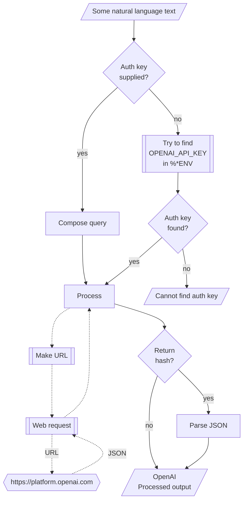

# WWW::OpenAI Raku package

## In brief

This Raku package provides access to the machine learning service [OpenAI](https://platform.openai.com), [OAI1].
For more details of the OpenAI's API usage see [the documentation](https://platform.openai.com/docs/api-reference/making-requests), [OAI2].

**Remark:** To use the OpenAI API one has to register and obtain authorization key.

**Remark:** This Raku package is much "less ambitious" than the official Python package, [OAIp1], developed by OpenAI's team.
Gradually, over time, I expect to add features to the Raku package that correspond to features of [OAIp1].

The original design and implementation of "WWW::OpenAI" were very similar to those of
["Lingua::Translation::DeepL"](https://raku.land/zef:antononcube/Lingua::Translation::DeepL), [AAp1].
Major refactoring of the original code was done -- now each OpenAI functionality targeted by "WWW::OpenAI"
has its code placed in a separate file.

-----

## Installation

Package installations from both sources use [zef installer](https://github.com/ugexe/zef)
(which should be bundled with the "standard" Rakudo installation file.)

To install the package from [Zef ecosystem](https://raku.land/) use the shell command:

```
zef install WWW::OpenAI
```

To install the package from the GitHub repository use the shell command:

```
zef install https://github.com/antononcube/Raku-WWW-OpenAI.git
```

----

## Usage examples

**Remark:** When the authorization key, `auth-key`, is specified to be `Whatever`
then the functions `openai-*` attempt to use the env variable `OPENAI_API_KEY`.

### Universal "front-end"

The package has an universal "front-end" function `openai-playground` for the 
[different functionalities provided by OpenAI](https://platform.openai.com/docs/api-reference/introduction).

Here is a simple call for a "chat completion":

```perl6
use WWW::OpenAI;
openai-playground('Where is Roger Rabbit?', max-tokens => 64);
```
```
# [{finish_reason => stop, index => 0, logprobs => (Any), text => 
# 
# Roger Rabbit is a fictional character created by Disney. He is not a real person and does not exist in the physical world.}]
```

Another one using Bulgarian:

```perl6
openai-playground('Колко групи могат да се намерят в този облак от точки.', max-tokens => 64);
```
```
# [{finish_reason => length, index => 0, logprobs => (Any), text => 
# 
# В облак от точки може да бъдат намерени произволен брой г}]
```

**Remark:** The function `openai-completion` can be used instead in the examples above. 
See the section 
["Create chat completion"](https://platform.openai.com/docs/api-reference/chat/create) of [OAI2]
for more details.

### Models

The current OpenAI models can be found with the function `openai-models`:

```perl6
openai-models
```
```
# (ada ada-code-search-code ada-code-search-text ada-search-document ada-search-query ada-similarity babbage babbage-002 babbage-code-search-code babbage-code-search-text babbage-search-document babbage-search-query babbage-similarity code-davinci-edit-001 code-search-ada-code-001 code-search-ada-text-001 code-search-babbage-code-001 code-search-babbage-text-001 curie curie-instruct-beta curie-search-document curie-search-query curie-similarity davinci davinci-002 davinci-instruct-beta davinci-search-document davinci-search-query davinci-similarity gpt-3.5-turbo gpt-3.5-turbo-0301 gpt-3.5-turbo-0613 gpt-3.5-turbo-16k gpt-3.5-turbo-16k-0613 gpt-4 gpt-4-0314 gpt-4-0613 text-ada-001 text-babbage-001 text-curie-001 text-davinci-001 text-davinci-002 text-davinci-003 text-davinci-edit-001 text-embedding-ada-002 text-search-ada-doc-001 text-search-ada-query-001 text-search-babbage-doc-001 text-search-babbage-query-001 text-search-curie-doc-001 text-search-curie-query-001 text-search-davinci-doc-001 text-search-davinci-query-001 text-similarity-ada-001 text-similarity-babbage-001 text-similarity-curie-001 text-similarity-davinci-001 whisper-1)
```

### Code generation

There are two types of completions : text and chat. Let us illustrate the differences
of their usage by Raku code generation. Here is a text completion:

```perl6
openai-completion(
        'generate Raku code for making a loop over a list',
        type => 'text',
        max-tokens => 120,
        format => 'values');
```
```
# my @list = <a b c d e>;
# 
# for @list -> $item {
#     say $item;
# }
```

Here is a chat completion:

```perl6
openai-completion(
        'generate Raku code for making a loop over a list',
        type => 'chat',
        max-tokens => 120,
        format => 'values');
```
```
# Sure! Here's an example of how you can create a loop over a list in Raku:
# 
# ```raku
# my @list = 1, 2, 3, 4, 5;
# 
# for @list -> $item {
#     say $item;
# }
# ```
# 
# This code declares an array `@list` containing the values `1, 2, 3, 4, 5`. Then, it uses a `for` loop to iterate over each item in the list. The loop variable `$item` takes on the value of each element in the list,
```

**Remark:** The argument "type" and the argument "model" have to "agree." (I.e. be found agreeable by OpenAI.)
For example: 
- `model => 'text-davinci-003'` implies `type => 'text'`
- `model => 'gpt-3.5-turbo'` implies `type => 'chat'`


### Image generation

**Remark:** See the files ["Image-generation*"](./docs/Image-generation.md) for more details.

Images can be generated with the function `openai-create-image` -- see the section
["Images"](https://platform.openai.com/docs/api-reference/images) of [OAI2].

Here is an example:

```perl6, eval=FALSE
my $imgB64 = openai-create-image(
        "racoon with a sliced onion in the style of Raphael",
        response-format => 'b64_json',
        n => 1,
        size => 'small',
        format => 'values',
        method => 'tiny');
```

Here are the options descriptions:

- `response-format` takes the values "url" and "b64_json"
- `n` takes a positive integer, for the number of images to be generated
- `size` takes the values '1024x1024', '512x512', '256x256', 'large', 'medium', 'small'. 

Here we generate an image, get its URL, and place (embed) a link to it via the output of the code cell:

```perl6, results='asis', eval=FALSE
my @imgRes = |openai-create-image(
        "racoon and onion in the style of Roy Lichtenstein",
        response-format => 'url',
        n => 1,
        size => 'small',
        method => 'tiny');

'';
```

### Image variation

**Remark:** See the files ["Image-variation*"](./docs/Image-variation.md) for more details.

Images variations over image files can be generated with the function `openai-variate-image` 
-- see the section
["Images"](https://platform.openai.com/docs/api-reference/images) of [OAI2].

Here is an example:

```perl6, eval=FALSE
my $imgB64 = openai-variate-image(
        $*CWD ~ '/resources/RandomMandala.png',
        response-format => 'b64_json',
        n => 1,
        size => 'small',
        format => 'values',
        method => 'tiny');
```

Here are the options descriptions:

- `response-format` takes the values "url" and "b64_json"
- `n` takes a positive integer, for the number of images to be generated
- `size` takes the values '1024x1024', '512x512', '256x256', 'large', 'medium', 'small'.

**Remark:** Same arguments are used by `openai-generate-image`. See the previous sub-section.

Here we generate an image, get its URL, and place (embed) a link to it via the output of the code cell:

```perl6, results='asis', eval=FALSE
my @imgRes = |openai-variate-image(
        $*CWD ~ '/resources/RandomMandala.png',
        response-format => 'url',
        n => 1,
        size => 'small',
        method => 'tiny');

'';
```

### Moderation

Here is an example of using 
[OpenAI's moderation](https://platform.openai.com/docs/api-reference/moderations):

```perl6
my @modRes = |openai-moderation(
"I want to kill them!",
format => "values",
method => 'tiny');

for @modRes -> $m { .say for $m.pairs.sort(*.value).reverse; }
```
```
# violence => 0.99612075
# harassment => 0.67532283
# harassment/threatening => 0.62305135
# hate => 0.12013233
# hate/threatening => 0.019687966
# sexual => 3.7803213e-07
# sexual/minors => 8.417105e-08
# violence/graphic => 7.003105e-08
# self-harm => 3.3011907e-10
# self-harm/intent => 4.8435887e-11
# self-harm/instructions => 3.1562556e-13
```

### Audio transcription and translation

Here is an example of using
[OpenAI's audio transcription](https://platform.openai.com/docs/api-reference/audio):

```perl6
my $fileName = $*CWD ~ '/resources/HelloRaccoonsEN.mp3';
say openai-audio(
        $fileName,
        format => 'json',
        method => 'tiny');
```
```
# {
#   "text": "Raku practitioners around the world, eat more onions!"
# }
```

To do translations use the named argument `type`:

```perl6
my $fileName = $*CWD ~ '/resources/HowAreYouRU.mp3';
say openai-audio(
        $fileName,
        type => 'translations',
        format => 'json',
        method => 'tiny');
```
```
# {
#   "text": "How are you, bandits, hooligans? I have long gone mad from you. I have been working as a guard all my life."
# }
```

### Embeddings

[Embeddings](https://platform.openai.com/docs/api-reference/embeddings)
can be obtained with the function `openai-embeddings`. Here is an example of finding the embedding vectors
for each of the elements of an array of strings:

```perl6
my @queries = [
    'make a classifier with the method RandomForeset over the data dfTitanic',
    'show precision and accuracy',
    'plot True Positive Rate vs Positive Predictive Value',
    'what is a good meat and potatoes recipe'
];

my $embs = openai-embeddings(@queries, format => 'values', method => 'tiny');
$embs.elems;
```
```
# 4
```

Here we show:
- That the result is an array of four vectors each with length 1536
- The distributions of the values of each vector

```perl6
use Data::Reshapers;
use Data::Summarizers;

say "\$embs.elems : { $embs.elems }";
say "\$embs>>.elems : { $embs>>.elems }";
records-summary($embs.kv.Hash.&transpose);
```
```
# $embs.elems : 4
# $embs>>.elems : 1536 1536 1536 1536
# +-------------------------------+--------------------------------+-------------------------------+-------------------------------+
# | 0                             | 2                              | 3                             | 1                             |
# +-------------------------------+--------------------------------+-------------------------------+-------------------------------+
# | Min    => -0.5909183          | Min    => -0.6317349           | Min    => -0.6046351          | Min    => -0.6675025          |
# | 1st-Qu => -0.0132305285       | 1st-Qu => -0.0125328135        | 1st-Qu => -0.0129117165       | 1st-Qu => -0.012251829        |
# | Mean   => -0.0007621561868711 | Mean   => -0.00072983182428451 | Mean   => -0.0007544719890944 | Mean   => -0.0007621980843776 |
# | Median => -0.00105795915      | Median => -0.000614395015      | Median => -0.00069994953      | Median => -0.00030214088      |
# | 3rd-Qu => 0.01234658475       | 3rd-Qu => 0.0118909715         | 3rd-Qu => 0.012180326         | 3rd-Qu => 0.011142723         |
# | Max    => 0.21186024          | Max    => 0.2126322            | Max    => 0.22217143          | Max    => 0.22837932          |
# +-------------------------------+--------------------------------+-------------------------------+-------------------------------+
```

Here we find the corresponding dot products and (cross-)tabulate them:

```perl6
use Data::Reshapers;
use Data::Summarizers;
my @ct = (^$embs.elems X ^$embs.elems).map({ %( i => $_[0], j => $_[1], dot => sum($embs[$_[0]] >>*<< $embs[$_[1]])) }).Array;

say to-pretty-table(cross-tabulate(@ct, 'i', 'j', 'dot'), field-names => (^$embs.elems)>>.Str);
```
```
# +---+----------+----------+----------+----------+
# |   |    0     |    1     |    2     |    3     |
# +---+----------+----------+----------+----------+
# | 0 | 1.000000 | 0.724884 | 0.756981 | 0.665537 |
# | 1 | 0.724884 | 1.000000 | 0.811288 | 0.715410 |
# | 2 | 0.756981 | 0.811288 | 1.000000 | 0.698958 |
# | 3 | 0.665537 | 0.715410 | 0.698958 | 1.000000 |
# +---+----------+----------+----------+----------+
````

**Remark:** Note that the fourth element (the cooking recipe request) is an outlier.
(Judging by the table with dot products.)

### Chat completions with engineered prompts

Here is a prompt for "emojification" (see the
[Wolfram Prompt Repository](https://resources.wolframcloud.com/PromptRepository/)
entry
["Emojify"](https://resources.wolframcloud.com/PromptRepository/resources/Emojify/)):

```perl6
my $preEmojify = q:to/END/;
Rewrite the following text and convert some of it into emojis.
The emojis are all related to whatever is in the text.
Keep a lot of the text, but convert key words into emojis.
Do not modify the text except to add emoji.
Respond only with the modified text, do not include any summary or explanation.
Do not respond with only emoji, most of the text should remain as normal words.
END
```
```
# Rewrite the following text and convert some of it into emojis.
# The emojis are all related to whatever is in the text.
# Keep a lot of the text, but convert key words into emojis.
# Do not modify the text except to add emoji.
# Respond only with the modified text, do not include any summary or explanation.
# Do not respond with only emoji, most of the text should remain as normal words.
```

Here is an example of chat completion with emojification:

```perl6
openai-chat-completion([ system => $preEmojify, user => 'Python sucks, Raku rocks, and Perl is annoying'], max-tokens => 200, format => 'values')
```
```
# 🐍 Python 🤬, 💎 Raku 🤘, and 🐪 Perl 😡
```

For more examples see the document ["Chat-completion-examples"](./docs/Chat-completion-examples_woven.md).

### Finding textual answers

The models of OpenAI can be used to find sub-strings in texts that appear to be
answers to given questions. This is done via the package 
["ML::FindTextualAnswer"](https://raku.land/zef:antononcube/ML::FindTextualAnswer), [AAp3],
using the parameter specs `llm => 'chatgpt'` or `llm => 'openai'`.


Here is an example of finding textual answers:

```perl6
use ML::FindTextualAnswer;
my $text = "Lake Titicaca is a large, deep lake in the Andes 
on the border of Bolivia and Peru. By volume of water and by surface 
area, it is the largest lake in South America";

find-textual-answer($text, "Where is Titicaca?", llm => 'openai')
```
```
#ERROR: Could not find ML::FindTextualAnswer in:
#ERROR:     /Users/antonov/.raku
#ERROR:     /Users/antonov/.rakubrew/versions/moar-2023.08/share/perl6/site
#ERROR:     /Users/antonov/.rakubrew/versions/moar-2023.08/share/perl6/vendor
#ERROR:     /Users/antonov/.rakubrew/versions/moar-2023.08/share/perl6/core
#ERROR:     CompUnit::Repository::AbsolutePath<3853085078456>
#ERROR:     CompUnit::Repository::NQP<3852978437320>
#ERROR:     CompUnit::Repository::Perl5<3852978437360>
# Nil
```

By default `find-textual-answer` tries to give short answers.
If the option "request" is `Whatever` then depending on the number of questions 
the request is one those phrases:
- "give the shortest answer of the question:"
- "list the shortest answers of the questions:"

In the example above the full query given to OpenAI's models is:

> Given the text "Lake Titicaca is a large, deep lake in the Andes
on the border of Bolivia and Peru. By volume of water and by surface
area, it is the largest lake in South America" 
> give the shortest answer of the question:   
> Where is Titicaca?

Here we get a longer answer by changing the value of "request":

```perl6
find-textual-answer($text, "Where is Titicaca?", llm => 'chatgpt', request => "answer the question:")
```
```
#ERROR: Variable '$text' is not declared.  Did you mean '&next'?
# Nil
```

**Remark:** The function `find-textual-answer` is inspired by the Mathematica function
[`FindTextualAnswer`](https://reference.wolfram.com/language/ref/FindTextualAnswer.html); 
see [JL1].

#### Multiple questions

If several questions are given to the function `find-textual-answer`
then all questions are spliced with the given text into one query (that is sent to OpenAI.)

For example, consider the following text and questions:

```perl6
my $query = 'Make a classifier with the method RandomForest over the data dfTitanic; show precision and accuracy.';

my @questions =
        ['What is the dataset?',
         'What is the method?',
         'Which metrics to show?'
        ];
```
```
# [What is the dataset? What is the method? Which metrics to show?]
```

Then the query send to OpenAI is:

> Given the text: "Make a classifier with the method RandomForest over the data dfTitanic; show precision and accuracy."
> list the shortest answers of the questions:   
> 1) What is the dataset?   
> 2) What is the method?    
> 3) Which metrics to show?   


The answers are assumed to be given in the same order as the questions, each answer in a separated line.
Hence, by splitting the OpenAI result into lines we get the answers corresponding to the questions.  

If the questions are missing question marks, it is likely that the result may have a completion as 
a first line followed by the answers. In that situation the answers are not parsed and a warning message is given.

-------

## Command Line Interface

### Playground access

The package provides a Command Line Interface (CLI) script:

```shell
openai-playground --help
```
```
# Usage:
#   /Users/antonov/.rakubrew/versions/moar-2023.08/share/perl6/site/bin/openai-playground [<words> ...] [--path=<Str>] [-n[=UInt]] [--mt|--max-tokens[=UInt]] [-m|--model=<Str>] [-r|--role=<Str>] [-t|--temperature[=Real]] [-l|--language=<Str>] [--response-format=<Str>] [-a|--auth-key=<Str>] [--timeout[=UInt]] [-f|--format=<Str>] [--method=<Str>] -- Command given as a sequence of words.
#   
#     --path=<Str>                Path, one of 'chat/completions', 'images/generations', 'images/variations', 'moderations', 'audio/transcriptions', 'audio/translations', 'embeddings', or 'models'. [default: 'chat/completions']
#     -n[=UInt]                   Number of completions or generations. [default: 1]
#     --mt|--max-tokens[=UInt]    The maximum number of tokens to generate in the completion. [default: 100]
#     -m|--model=<Str>            Model. [default: 'Whatever']
#     -r|--role=<Str>             Role. [default: 'user']
#     -t|--temperature[=Real]     Temperature. [default: 0.7]
#     -l|--language=<Str>         Language. [default: '']
#     --response-format=<Str>     The format in which the generated images are returned; one of 'url' or 'b64_json'. [default: 'url']
#     -a|--auth-key=<Str>         Authorization key (to use OpenAI API.) [default: 'Whatever']
#     --timeout[=UInt]            Timeout. [default: 10]
#     -f|--format=<Str>           Format of the result; one of "json", "hash", "values", or "Whatever". [default: 'Whatever']
#     --method=<Str>              Method for the HTTP POST query; one of "tiny" or "curl". [default: 'tiny']
```

**Remark:** When the authorization key argument "auth-key" is specified set to "Whatever"
then `openai-playground` attempts to use the env variable `OPENAI_API_KEY`.


--------

## Mermaid diagram

The following flowchart corresponds to the steps in the package function `openai-playground`:



--------

## Potential problems

### Tested on macOS only

Currently this package is tested on macOS only.

### SSL certificate problems (original package version)

*(This subsection is for the original version of the package, not for the most recent one.)*


- On macOS I get the errors:
    
  > Cannot locate symbol 'SSL_get1_peer_certificate' in native library

- See longer discussions about this problem 
  [here](https://stackoverflow.com/questions/72792280/macos-how-to-avoid-ssl-hell-on-intel-mac-with-raku)
  and
  [here](https://github.com/jnthn/p6-io-socket-async-ssl/issues/66)
  
- Interestingly: 
  - I did not get these messages while implementing the changes of ver<1.1> of this package
  - I do not get these messages when using Raku in Markdown or Mathematica notebooks, [AA1],
    via the package ["Text::CodeProcessing"](https://raku.land/zef:antononcube/Text::CodeProcessing)
  
- Because of those SSL problems I implemented the method option that takes the values 'cro' and 'curl'.
  
- The method "curl":
  - Requires [`curl`](https://curl.se) to be installed
  - Invokes the procedure [`shell`](https://docs.raku.org/routine/shell)
  - Again, this is tested on macOS only.  

- After "discovering" "HTTP::Tiny" and given the problems with "Cro::HTTP::Client", I removed the 'cro' method.
  (I.e. the methods are 'tiny' and 'curl' in ver<0.2.0+>.)
  
--------

## TODO

- [X] DONE Comprehensive unit tests
  - Note that this requires OpenAI auth token and costs money. (Ideally, not much.)
  - [X] DONE Basic usage
  - [X] DONE Completions - chat
  - [X] DONE Completions - text
  - [X] DONE Moderation
  - [X] DONE Audio transcription
  - [X] DONE Audio translation
  - [X] DONE Image generation
  - [X] DONE Embeddings
  - [X] DONE Finding of textual answers

- [X] DONE HTTP(S) retrieval methods

  - [X] DONE `curl`
  - [X] DONE "Cro"
     - Not used in ver<0.2.0+>.
  - [X] DONE "HTTP::Tiny"

- [X] DONE Models implementation

- [X] DONE Embeddings implementation

- [X] DONE Refactor the code, so each functionality (audio, completion, moderation, etc)
  has a separate file.

- [X] DONE Refactor HTTP(S) retrieval functions to be simpler and more "uniform."

- [X] DONE De-Cro the request code.

  - Given the problems of using "Cro::HTTP::Client" and the implementations with `curl` and 
    ["HTTP::Tiny"](https://gitlab.com/jjatria/http-tiny/-/blob/master/examples/cookbook.md),
    it seems it is better to make the implementation of "WWW::OpenAI" more lightweight.

- [X] DONE Implement finding of textual answers

- [X] DONE Factor out finding of textual answers into a separate package
  - So, other LLMs can be used.
  - See ["ML::FindTextualAnswer"](https://github.com/antononcube/Raku-ML-FindTextualAnswer).

--------

## References

### Articles

[AA1] Anton Antonov,
["Connecting Mathematica and Raku"](https://rakuforprediction.wordpress.com/2021/12/30/connecting-mathematica-and-raku/),
(2021),
[RakuForPrediction at WordPress](https://rakuforprediction.wordpress.com).

[JL1] Jérôme Louradour,
["New in the Wolfram Language: FindTextualAnswer"](https://blog.wolfram.com/2018/02/15/new-in-the-wolfram-language-findtextualanswer),
(2018),
[blog.wolfram.com](https://blog.wolfram.com/).

### Packages

[AAp1] Anton Antonov,
[Lingua::Translation::DeepL Raku package](https://github.com/antononcube/Raku-Lingua-Translation-DeepL),
(2022),
[GitHub/antononcube](https://github.com/antononcube).

[AAp2] Anton Antonov,
[Text::CodeProcessing](https://github.com/antononcube/Raku-Text-CodeProcessing),
(2021),
[GitHub/antononcube](https://github.com/antononcube).

[AAp3] Anton Antonov,
[ML::FindTextualAnswer](https://github.com/antononcube/Raku-ML-FindTextualAnswer),
(2023),
[GitHub/antononcube](https://github.com/antononcube).


[OAI1] OpenAI Platform, [OpenAI platform](https://platform.openai.com/).

[OAI2] OpenAI Platform, [OpenAI documentation](https://platform.openai.com/docs).

[OAIp1] OpenAI,
[OpenAI Python Library](https://github.com/openai/openai-python),
(2020),
[GitHub/openai](https://github.com/openai/).