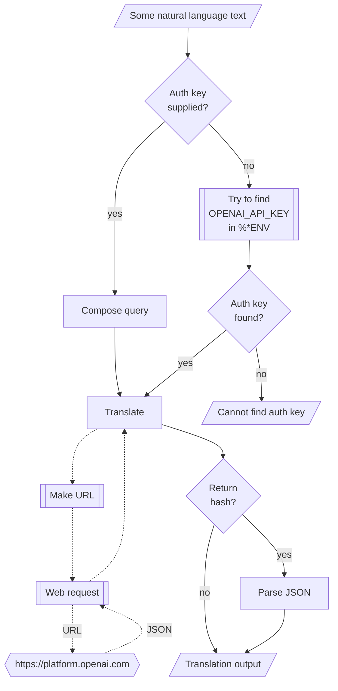

# WWW::OpenAI Raku package

## In brief

This Raku package provides access to the language translation service [OpenAI](https://platform.openai.com), [OAI1].
For more details of the OpenAI's API usage see [the documentation](https://platform.openai.com/docs/api-reference/making-requests), [OAI2].

**Remark:** To use the OpenAI API one has to register and obtain authorization key.

**Remark:** This Raku package is much "less ambitious" than the official Python package, [OAIp1], developed by OpenAI's team.
Gradually, over time, I expect to add features to the Raku package that correspond to features of [OAIp1].

-----

## Installation

Package installations from both sources use [zef installer](https://github.com/ugexe/zef)
(which should be bundled with the "standard" Rakudo installation file.)

To install the package from [Zef ecosystem](https://raku.land/) use the shell command:

```
zef install WWW::OpenAI
```

To install the package from the GitHub repository use the shell command:

```
zef install https://github.com/antononcube/Raku-WWW-OpenAI.git
```

----

## Usage examples

**Remark:** When the authorization key, `auth-key`, is specified to be `Whatever`
then `openai-playground` attempts to use the env variable `OPENAI_API_KEY`.

### Basic usage

Here is a simple call:

```perl6
use WWW::OpenAI;
say openai-playground('Колко групи могат да се намерят в този облак от точки.');
```
``` 
# {choices => [{finish_reason => stop, index => 0, message => {content => 
# 
# Като AI модел, не мога да визуализирам облак от точки, но мога да кажа, че броят на групите, които могат да се образуват от тези точки, зависи от техния разположение и от критериите за групиране. Например, ако имаме 5 точки, можем да ги разделим в 1 група (ако са близо една до друга), 5 групи (ако са много отдалечени една от друга) или няколко групи, ако имаме различни критерии за групиране, като цвят, форма или размер на точките. Така че, без да имаме повече информация, не можем да определим точен брой на групите в облака от точки., role => assistant}}], created => 1678462673, id => chatcmpl-6sZ6X0YtK8HajxuGyJQsswHWsO3eM, model => gpt-3.5-turbo-0301, object => chat.completion, usage => {completion_tokens => 262, prompt_tokens => 35, total_tokens => 297}}
```

-------

## Command Line Interface

The package provides a Command Line Interface (CLI) script:

```shell
openai-playground --help
```
```
Usage:
  openai-playground <text> [-m|--model=<Str>] [-r|--role=<Str>] [-t|--temperature[=Real]] [-a|--auth-key=<Str>] [--timeout[=UInt]] [--format=<Str>] -- Text processing using the OpenAI API.
  
    <text>                     Text to be processed.
    -m|--model=<Str>           Model. [default: 'Whatever']
    -r|--role=<Str>            Role. [default: 'user']
    -t|--temperature[=Real]    Temperature. [default: 0.7]
    -a|--auth-key=<Str>        Authorization key (to use OpenAI API.) [default: 'Whatever']
    --timeout[=UInt]           Timeout. [default: 10]
    --format=<Str>             Format of the result; one of "json" or "hash". [default: 'json']
```


**Remark:** When the authorization key argument "auth-key" is specified set to "Whatever"
then `openai-playground` attempts to use the env variable `OPENAI_API_KEY`.

--------

## Mermaid diagram

The following flowchart corresponds to the steps in the package function `openai-playground`:



--------

## Potential problems

*TBD..*

--------

## References

[OAI1] OpenAI Platform, [OpenAI platform](https://platform.openai.com/).

[OAI1] OpenAI Platform, [OpenAI documentation](https://platform.openai.com/docs).

[OAIp1] OpenAI,
[OpenAI Python Library](https://github.com/openai/openai-python),
(2020),
[GitHub/openai](https://github.com/openai/).