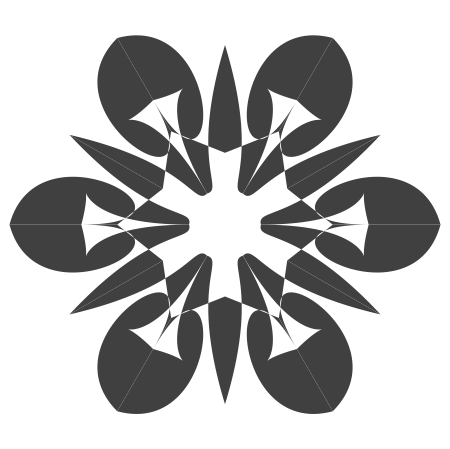
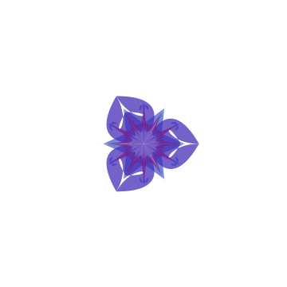

# Image variation and edition

This Markdown file can be "evaluated" with the Raku package "Text::CodeProcessing", [AAp2]. 
Here is a shell command:

```
file-code-chunks-eval Image-variation-and-edition.md 
```

**Remark:** For doing image *generations* using text prompts see the document
[Image-generation.md](./Image-generation.md)
(and its woven version, [Image-generation_woven.md](./Image-generation_woven.md).)

------

## Image variation

Here we load the Raku package "WWW::OpenAI", [AAp1]:

```perl6
use WWW::OpenAI;
```

Variations of images can be generated with the function `openai-variate-image` -- see the section
["Images"](https://platform.openai.com/docs/api-reference/images) of [OAI2].

Here is a (random mandala) image:



**Remark:** Below we refer to the image above as "the original image."

Here we generate a few variations of the image above, 
and get "whole images" in [Base64 format](https://en.wikipedia.org/wiki/Base64):

```perl6, results=asis
my @imgResB64 = |openai-variate-image(
        $*CWD ~ '/../resources/RandomMandala.png',
        n => 2,
        size => 'small',
        response-format => 'b64_json',
        format => 'values',
        method => 'tiny');

@imgResB64.map({ '' }).join("\n\n")        
```

**Remark:** The obtained images are put into the *woven* document via the output of the code cell, 
which has the setting `results=asis`.

The first argument is a *prompt* used to generate the image(s).

Here are the descriptions of the named arguments (options):

- `n` takes a positive integer, for the number of images to be generated
- `size` takes the values '1024x1024', '512x512', '256x256', 'large', 'medium', 'small'.
- `response-format` takes the values "url" and "b64_json"
- `method` takes the values "tiny" and "curl"

Here we generate a few variations of the original mandala image above, get their URLs, 
and place (embed) the image links using a table:

```perl6, results=asis
my @imgRes = |openai-variate-image(
        $*CWD ~ '/../resources/RandomMandala.png',
        response-format => 'url',
        n => 2,
        size => 'small',
        format => 'values',
        method => 'tiny');

@imgRes.map({ '' }).join("\n\n")       
```

------

## Image edition

Editions of images can be generated with the function `openai-edit-image` -- see the section
["Images"](https://platform.openai.com/docs/api-reference/images) of [OAI2].

Here are the descriptions of positional arguments:

- `file` is a file name string (a PNG image with [RGBA color space](https://en.wikipedia.org/wiki/RGBA_color_model))
- `prompt` is a prompt tha describes the image edition

Here are the descriptions of the named arguments (options):

- `mask-file` a file name of a mask image (can be an empty string or `Whatever`)
- `n` takes a positive integer, for the number of images to be generated
- `size` takes the values '1024x1024', '512x512', '256x256', 'large', 'medium', 'small'.
- `response-format` takes the values "url" and "b64_json"
- `method` takes the values "tiny" and "curl"

Here is a random mandala color (RGBA) image:



Here we generate a few editions of the colored mandala image above, get their URLs,
and place (embed) the image links using a table:

```perl6, results=asis
my @imgRes = |openai-edit-image(
        $*CWD ~ '/../resources/RandomMandala2.png',
        'add cosmic background',
        response-format => 'url',
        n => 2,
        size => 'small',
        format => 'values',
        method => 'tiny');

@imgRes.map({ '' }).join("\n\n")       
```

--------

## References

### Articles

[AA1] Anton Antonov,
["Connecting Mathematica and Raku"](https://rakuforprediction.wordpress.com/2021/12/30/connecting-mathematica-and-raku/),
(2021),
[RakuForPrediction at WordPress](https://rakuforprediction.wordpress.com).

### Packages

[AAp1] Anton Antonov,
[WWW::OpenAI Raku package](https://github.com/antononcube/Raku-WWW-OpenAI),
(2023),
[GitHub/antononcube](https://github.com/antononcube).

[AAp2] Anton Antonov,
[Text::CodeProcessing](https://github.com/antononcube/Raku-Text-CodeProcessing),
(2021),
[GitHub/antononcube](https://github.com/antononcube).

[OAI1] OpenAI Platform, [OpenAI platform](https://platform.openai.com/).

[OAI2] OpenAI Platform, [OpenAI documentation](https://platform.openai.com/docs).

[OAIp1] OpenAI,
[OpenAI Python Library](https://github.com/openai/openai-python),
(2020),
[GitHub/openai](https://github.com/openai/).